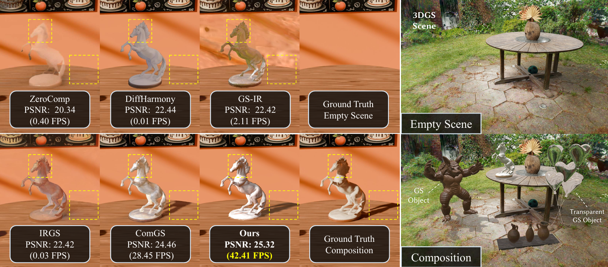

# Real-Time Object Composition in 3D Gaussian Splatting via Physics-Driven Light Transport Factorization

**Physically based, real-time object composition for 3D Gaussian Splatting.**

  

## Overview

This work enables **real-time, training-free object composition in pretrained 3D Gaussian Splatting (3DGS) scenes**.

Given a pretrained 3DGS scene and known PBR Gaussian assets, PhysCompose reformulates light transport to efficiently account for illumination, object self-occlusion, and object-to-scene shadows—without retraining the scene or relying on expensive voxel-based ray marching.

Our framework achieves **over 40 FPS on consumer hardware**, enabling interactive virtual-real composition under unconstrained lighting.

## Code

🚧 **Code coming soon.**

We are currently cleaning up and preparing the codebase for public release.
t made this work possible.
